整理了下自己的工作流，尽可能的利用 ChatGPT 和 Gemini，发挥它们各自的擅长点。

```mermaid
flowchart TD
    A([输入需求 / 目标]) --> B{是否已有资料?}

    %% ==== Info Gathering ====
    B -- 否 --> C["收集资料 / 搜索<br/>(Gemini：搜索、网页、视频、Drive、Docs、邮件)"]
    B -- 是 --> E["整理关键点与证据<br/>(Gemini：从Docs/Drive提要)"]

    C --> D{资料是否充分/可信?}
    D -- 否 --> C
    D -- 是 --> E

    %% ==== Understanding / Teaching ====
    E --> F["知识消化与讲解<br/>(ChatGPT：分层讲解、举例、误区提醒)"]
    F --> G{是否需要更多上下文?}
    G -- 是 --> C
    G -- 否 --> H["定义问题与成功标准<br/>(ChatGPT：目标拆解、评估准则)"]

    %% ==== Brainstorm & Design ====
    H --> I["头脑风暴候选方案<br/>(ChatGPT主生成; Gemini辅引用资料)"]
    I --> J["收敛与权衡取舍<br/>(ChatGPT：评分矩阵、决策表)"]
    J --> K["设计方案 / 技术路线 / 文档骨架<br/>(ChatGPT生成; Gemini同步Docs协作)"]

    %% ==== Build / Coding ====
    K --> L{是否需要编码实现?}
    L -- 否 --> O
    L -- 是 --> M["编码 / 调试 / 重构<br/>(ChatGPT：代码生成、单测、性能建议)"]
    M --> N{单测/验证是否通过?}
    N -- 否 --> M
    N -- 是 --> O["产出整合与文档化<br/>(Gemini写Docs; ChatGPT写README)"]

    %% ==== Review / Ship ====
    O --> P["评审与协作<br/>(Gemini：评论协作; ChatGPT：Checklist)"]
    P --> Q{是否达成成功标准?}
    Q -- 否 --> I
    Q -- 是 --> R([发布 / 交付])

    %% ==== Retrospective ====
    R --> S["复盘总结与知识沉淀<br/>(ChatGPT：经验卡片; Gemini：归档Drive)"]
    S --> T([下一步迭代 / 新需求])
```

上面是 mermaid 的代码图表，自行渲染查看流程，也可以下载 [Markmaid](https://chromewebstore.google.com/detail/markmaid/lagiicegickbilpdalbbhnhdihlhogni) 这个 chrome 插件在线预览。

希望抛砖引玉...